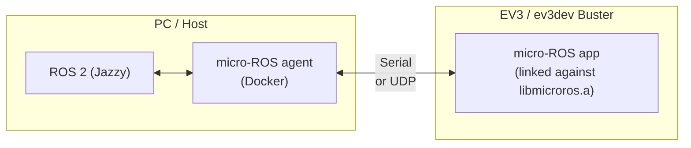

# micro_ros_ev3

micro-ROS for LEGO Mindstorms EV3 running **ev3dev Buster** (ARM926EJ-S, ARMv5TE, glibc 2.28).

This repository provides transport implementations and ready-to-build examples to run
micro-ROS nodes on the EV3 brick and communicate with a ROS 2 system over serial or UDP.

## System overview



## Repository structure

```
micro_ros_ev3/
├── ev3_toolchain.cmake
├── transport/
│   ├── time_compat.c                         ← glibc 2.28 compatibility shim (always required)
│   ├── serial_transport.c                    ← POSIX serial (termios, 115200 baud)
│   └── udp_transport.c                       ← POSIX UDP (sockets)
└── examples/
    ├── micro_ros_publisher_serial/           ← publisher over serial
    ├── micro_ros_publisher_udp/             ← publisher over UDP
    ├── micro_ros_subscriber/                ← subscriber over UDP
    ├── micro_ros_addtwoints_service/        ← AddTwoInts service server over UDP
    └── micro_ros_time_sync/                 ← time synchronisation with the agent over UDP
```

---

## Prerequisites

- PC with Docker installed (64-bit Linux)
- LEGO Mindstorms EV3 with [ev3dev Buster](https://www.ev3dev.org/)
- Serial or network connection between PC and EV3

---

## Step 1 — Get the micro-ROS static library

The static library (`libmicroros.a`) and headers are generated with a modified
[micro-ROS static library builder](https://github.com/racarla96/micro-ROS-docker/tree/feature/lego-ev3-support)
and the EV3 platform support added to
[micro_ros_arduino](https://github.com/racarla96/micro_ros_arduino/tree/feature/lego-ev3-support).

### Option A — Pull the pre-built builder image from Docker Hub (recommended)

```bash
docker pull racarla96/micro_ros_static_library_builder:jazzy-ev3
```

Then skip to [Step 1.3](#13-generate-the-library).

### Option B — Build the image yourself

```bash
git clone -b feature/lego-ev3-support https://github.com/racarla96/micro-ROS-docker.git
cd micro-ROS-docker
git clone -b feature/lego-ev3-support https://github.com/racarla96/micro_ros_arduino.git

cd micro-ROS-static-library-builder
docker build -t racarla96/micro_ros_static_library_builder:jazzy-ev3 .
```

> First build downloads several ARM toolchains and compiles micro-ROS with colcon.
> Expect 20–40 minutes.

### 1.3 Generate the library

Run from inside `micro-ROS-docker/micro-ROS-static-library-builder/`:

```bash
docker run -it \
  -v ./micro_ros_arduino:/project \
  -e MICROROS_LIBRARY_FOLDER=extras \
  --net=host \
  racarla96/micro_ros_static_library_builder:jazzy-ev3 \
  -p ev3
```

After completion:

```
micro_ros_arduino/src/
├── ev3/
│   └── libmicroros.a     ← static library
├── rcl/
├── rclc/
├── std_msgs/
├── example_interfaces/
└── ...                   ← all micro-ROS headers
```

---

## Step 2 — Set up the cross-compilation environment

ev3dev provides a Docker image with `arm-linux-gnueabi-gcc` pre-configured for ev3dev Buster:

```bash
docker pull ev3dev/debian-buster-cross
docker tag ev3dev/debian-buster-cross ev3cc
```

> Reference: https://www.ev3dev.org/docs/tutorials/using-docker-to-cross-compile/

The image does not include CMake by default. The build commands below install it
automatically inside the container at build time.

---

## Step 3 — Clone this repository

```bash
# Place it next to micro-ROS-docker/
git clone https://github.com/racarla96/micro_ros_ev3.git
cd micro_ros_ev3
```

---

## Step 4 — Build an example

All examples mount two volumes into the container:
- `$(pwd)` → `/src` (this repo)
- `<path-to-micro_ros_arduino/src>` → `/microros`

Adjust `agent_ip` in `main.c` before building UDP examples.

### Publisher — serial

Edit `examples/micro_ros_publisher_serial/main.c` and set the serial device
(see [serial devices table](#serial-devices-on-ev3dev)):

```c
(void *)"/dev/ttyS1",
```

```bash
docker run --rm -it \
  -v $(pwd):/src \
  -v $(pwd)/../micro-ROS-docker/micro_ros_arduino/src:/microros \
  -w /src ev3cc bash -c \
  "apt-get install -y cmake > /dev/null && \
   cmake -B build/publisher_serial examples/micro_ros_publisher_serial \
     -DCMAKE_TOOLCHAIN_FILE=ev3_toolchain.cmake \
     -DMICROROS_DIR=/microros && \
   cmake --build build/publisher_serial"
```

### Publisher — UDP

Edit `agent_ip` in `examples/micro_ros_publisher_udp/main.c`, then:

```bash
docker run --rm -it \
  -v $(pwd):/src \
  -v $(pwd)/../micro-ROS-docker/micro_ros_arduino/src:/microros \
  -w /src ev3cc bash -c \
  "apt-get install -y cmake > /dev/null && \
   cmake -B build/publisher_udp examples/micro_ros_publisher_udp \
     -DCMAKE_TOOLCHAIN_FILE=ev3_toolchain.cmake \
     -DMICROROS_DIR=/microros && \
   cmake --build build/publisher_udp"
```

### Subscriber — UDP

Subscribes to `ev3_topic` (std_msgs/Int32) and prints received values.

```bash
docker run --rm -it \
  -v $(pwd):/src \
  -v $(pwd)/../micro-ROS-docker/micro_ros_arduino/src:/microros \
  -w /src ev3cc bash -c \
  "apt-get install -y cmake > /dev/null && \
   cmake -B build/subscriber examples/micro_ros_subscriber \
     -DCMAKE_TOOLCHAIN_FILE=ev3_toolchain.cmake \
     -DMICROROS_DIR=/microros && \
   cmake --build build/subscriber"
```

Test from the PC:
```bash
ros2 topic pub /ev3_topic std_msgs/msg/Int32 "{data: 42}"
```

### AddTwoInts service server — UDP

Exposes `/addtwoints` (example_interfaces/srv/AddTwoInts).

```bash
docker run --rm -it \
  -v $(pwd):/src \
  -v $(pwd)/../micro-ROS-docker/micro_ros_arduino/src:/microros \
  -w /src ev3cc bash -c \
  "apt-get install -y cmake > /dev/null && \
   cmake -B build/service examples/micro_ros_addtwoints_service \
     -DCMAKE_TOOLCHAIN_FILE=ev3_toolchain.cmake \
     -DMICROROS_DIR=/microros && \
   cmake --build build/service"
```

Test from the PC:
```bash
ros2 service call /addtwoints example_interfaces/srv/AddTwoInts "{a: 3, b: 5}"
```

### Time synchronisation — UDP

Synchronises the EV3 clock with the agent and prints the current UTC time every second.

```bash
docker run --rm -it \
  -v $(pwd):/src \
  -v $(pwd)/../micro-ROS-docker/micro_ros_arduino/src:/microros \
  -w /src ev3cc bash -c \
  "apt-get install -y cmake > /dev/null && \
   cmake -B build/time_sync examples/micro_ros_time_sync \
     -DCMAKE_TOOLCHAIN_FILE=ev3_toolchain.cmake \
     -DMICROROS_DIR=/microros && \
   cmake --build build/time_sync"
```

---

## Step 5 — Copy the binary to the EV3

Default ev3dev Buster credentials: **user** `robot`, **password** `maker`.

```bash
# Copy and set executable permissions in one step
scp build/publisher_udp/micro_ros_publisher_udp robot@ev3dev.local:~
ssh robot@ev3dev.local chmod +x micro_ros_publisher_udp
```

The binary can then be launched directly from the EV3 screen using the
ev3dev Buster file manager, or from an SSH/serial terminal.

---

## Step 6 — Run the micro-ROS agent on the PC

### Serial agent

```bash
docker run -it --rm --privileged -v /dev:/dev \
  microros/micro-ros-agent:jazzy \
  serial --dev /dev/ttyUSB0 -b 115200
```

### UDP agent

```bash
docker run -it --rm --net=host \
  microros/micro-ros-agent:jazzy \
  udp4 --port 8888
```

---

## Step 7 — Run on the EV3

### From an SSH or serial terminal

```bash
ssh robot@ev3dev.local
./micro_ros_publisher_udp
```

### From the EV3 screen

If the binary has executable permissions (set in Step 5), it can be launched
directly from the ev3dev Buster file manager on the EV3 screen without needing
a PC terminal open.

### Verify on the PC

```bash
ros2 topic echo /ev3_topic
```

---

## Serial devices on ev3dev

| Connection | Device on EV3 |
|---|---|
| USB cable (micro-USB ↔ USB-A) | `/dev/ttyGS0` |
| EV3 sensor port 1 (UART) | `/dev/ttyS1` |
| Bluetooth serial | `/dev/ttyS2` |

Check available devices: `ls /dev/tty*`

---

## Notes

### glibc compatibility (`transport/time_compat.c`)

The library is built on Ubuntu 24.04 (glibc 2.39), which redirects `clock_gettime`
to `__clock_gettime64` on 32-bit ARM. ev3dev Buster (glibc 2.28) lacks that symbol.
`time_compat.c` provides the missing wrapper and **must always be included** in the build.

### Debug build

```bash
# Add -DCMAKE_C_FLAGS=-g to the cmake invocation, then on the EV3:
gdbserver :1234 ./my_node

# On the PC:
arm-linux-gnueabi-gdb build/.../my_node
(gdb) target remote ev3dev.local:1234
```

### Installing extra libraries

```bash
docker run --rm -it ev3cc bash
sudo apt-get install libsomething-dev:armel
```
